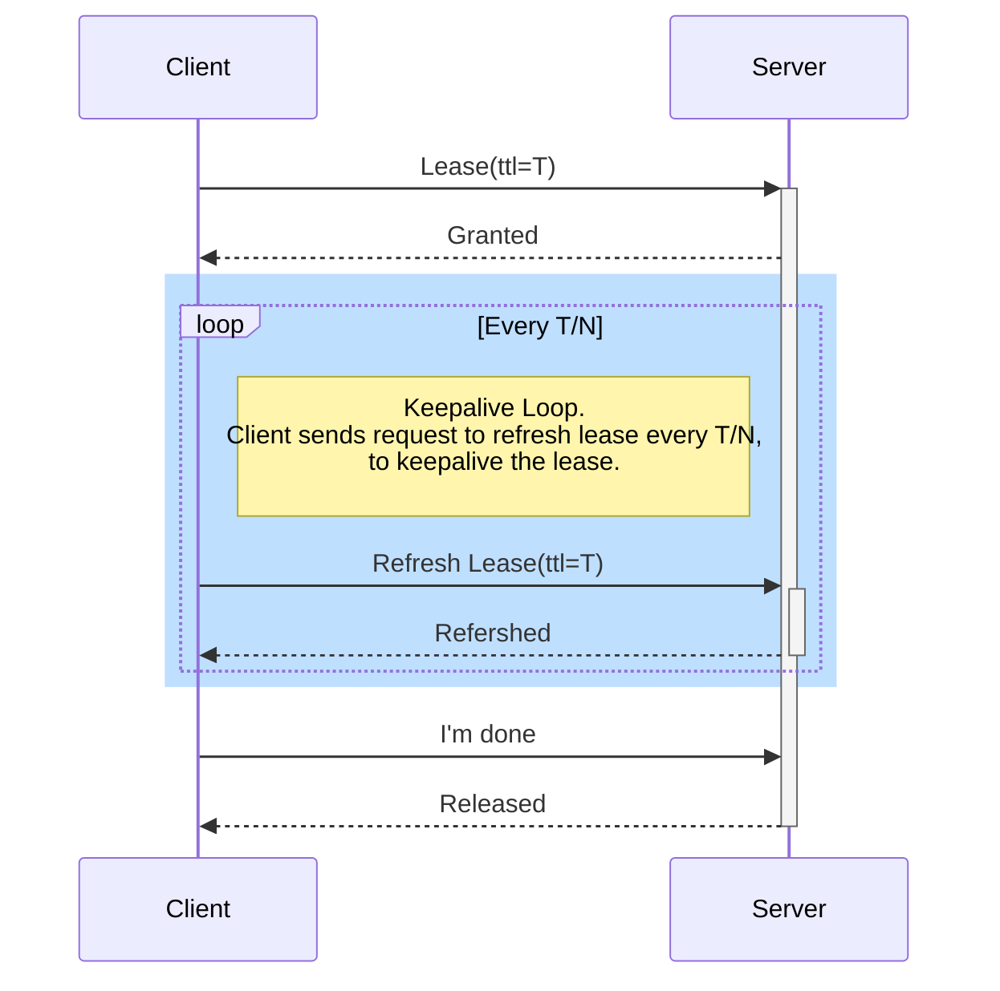

## Example
```golang
func (child *Children) WantsToPlay(computer *Computer, timeToEat *sync.WaitGroup) error {
        defer timeToEat.Done()

        fmt.Printf("%s wants to play\n", child.name)

        session, err := concurrency.NewSession(computer.cpu, concurrency.WithTTL(10000))
        if err != nil {
                return err
        }
        defer session.Close()

        seat := concurrency.NewMutex(session, computer.name)
        if child.isPatient {
                if err := seat.Lock(context.TODO()); err != nil {
                        return err
                }
        } else {
                if err := seat.TryLock(context.TODO()); err != nil {
                        if err == concurrency.ErrLocked {
                                fmt.Printf("someone else is playing, %s impatientlly leaves\n", child.name)
                                return nil
                        } else {
                                return err
                        }
                }
        }

        fmt.Printf("%s is playing his favorite game: %s\n", child.name, child.favoriteGame)
        time.Sleep(time.Duration(rand.Int()%10+1) * time.Second)
        fmt.Printf("%s is having fun\n", child.name)
        if err := seat.Unlock(context.TODO()); err != nil {
                return err
        }
        return nil
}
```

## Lease And Keepalive



## Reference
* [How Linux Cron Works](https://stackoverflow.com/questions/3982957/how-does-cron-internally-schedule-jobs)
* [Cron Distributed In Golang](https://github.com/Scalingo/go-etcd-cron)
* [Next Distributed Lock In Etcd](https://programmer.ink/think/implementation-of-etcd-distributed-lock.html)