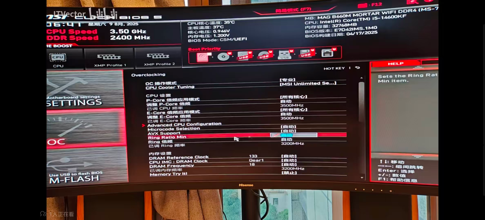

# GTA5 需要Battleye才能游玩GTA在线模式，请重启...解决方案.md

最近换了新机器后在玩GTA5OL时经常遇到这个报错，报错时机：
1. 切换新战局时，不管是公开战局还是私有战局
2. 任务结算，几乎是100%触发

网上看到许多人遇到这个问题都没有解决方案，找R⭐️客服也是一如既往的轱辘话~在经过一番费劲的搜索后终于从这篇文章中看到一个九分靠谱的分析：。文章结论是游戏在**高版本CPU微码的主板BIOS**上有BUG，需要回退BIOS到某个老版本。

回退BIOS版本并不是个简单的事情，与其去折腾这些我不如捏着鼻子玩，但好歹知道了问题是跟CPU微码有关。经过我的一番个人测试后，发现并不需要回退BIOS版本，只需要修改微码设置即可，具体解决方案：

1. 开机时按F2/Del键进入BIOS设置页面
2. 进入超频设置->Microcode Selection

3. 选择 No UVP，保存并重启即可

调整后切战局和结算都不再报错，终于可以顺利的上岛了👏🏻👏🏻👏🏻
